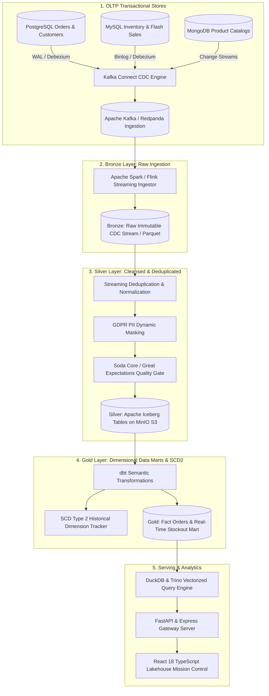

# E-Commerce Real-Time Change Data Capture (CDC) Lakehouse

[](#)
[](#)
[](#)

A production-grade, distributed Change Data Capture (CDC) and Medallion Lakehouse platform engineered to stream transactional database mutations (**PostgreSQL WAL & MySQL Binlog**) with sub-second replication latency, automated schema evolution, ACID snapshot isolation, and SCD Type 2 historical dimension tracking.

---

## 🌐 Medallion Lakehouse Architecture



---

## 🚀 Key Modules & Capabilities

1. **Change Data Capture (CDC) Ingestion (`cdc_connectors/`)**:
   - Low-overhead Debezium PostgreSQL WAL and MySQL binlog ingestion connectors.
   - Avro schema registry integration with zero-downtime forward/backward compatibility checks.
   - Dynamic schema mutation and column drift detector.

2. **Lakehouse Storage Engine (`lakehouse_engine/`)**:
   - **Apache Iceberg / Delta Lake Format**: Full ACID transactions, snapshot isolation, and time-travel querying.
   - **Compaction & Z-Ordering**: Automated small-file compaction and Morton curve multi-column clustering.
   - **MinIO S3 Integration**: S3-compatible object storage tier with lifecycle pruning.

3. **Medallion Architecture & dbt Transformations (`dbt_lakehouse/`)**:
   - **Bronze**: Append-only raw mutation logs with transaction timestamp watermarking.
   - **Silver**: Deduplicated, cleansed, and PII-masked (tokenized credit cards, hashed emails).
   - **Gold**: Star-schema dimension tables with Slowly Changing Dimensions (SCD Type 2) tracking customer address history and price changes.

4. **Data Quality & Contract Enforcement (`data_quality/`)**:
   - Continuous schema validation and value assertion checks via Great Expectations & Soda Core.
   - Automated Quarantine & Dead Letter Queue (DLQ) for corrupted transactional mutations.

5. **Interactive Operations Console (`frontend/` & `server.js`)**:
   - Real-time CDC replication lag and throughput monitoring.
   - Live schema drift detector and table snapshot inspection workbench.

---

## 🛠️ Quickstart & Local Execution

### 1. Installation & Environment Setup
```bash
# Clone the repository
git clone git@github.com:gandhikomarala/-E-Commerce-Real-Time-Change-Data-Capture.git
cd -E-Commerce-Real-Time-Change-Data-Capture

# Copy safe configuration template
cp example.env .env.local

# Install dependencies
npm install
```

### 2. Run Verified Live Server
```bash
# Launch the unified API gateway and live analytics console
node server.js
```
* Access Web Dashboard: **`http://localhost:3000`**
* Health Probe: **`http://localhost:3000/api/health`**
* Live CDC Telemetry: **`http://localhost:3000/api/cdc/stats`**

### 3. Run Automated Domain Test Suite
```bash
# Execute unit and stream processing tests
npm test
# OR with Python
python -m pytest tests/
```

---

## 🔒 Security & Data Privacy
- **Zero Committed Secrets**: Strict `.gitignore` enforcement and environment template standard.
- **GDPR & PCI-DSS Compliance**: Automated PII masking and field-level encryption.
- **Proprietary Commercial Architecture**: Built exclusively for high-velocity enterprise e-commerce platforms.
